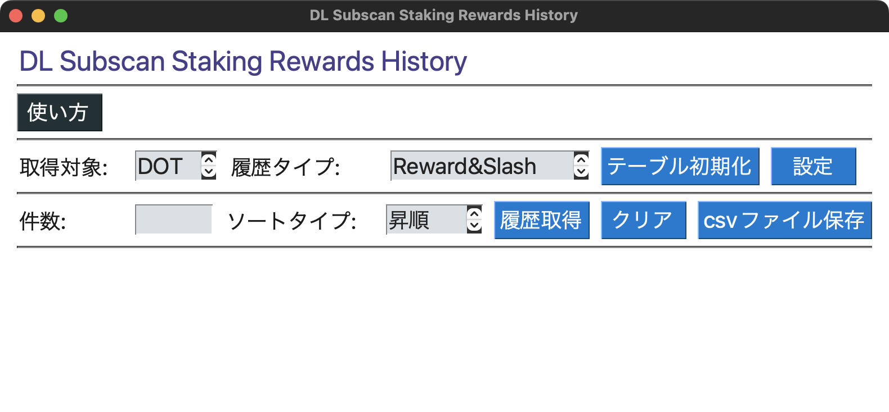
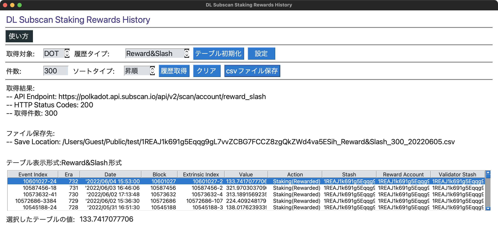

# dlSubscanStakingRewardsHistory
PySimpleGUIとSubscan APIを使用してReward&amp;Slashのデータをcsvファイルで保存するGUIアプリ

     

## 概要
PySimpleGUIとSubscan APIを使用して下記形式のデータをcsvファイルで保存します。
* Reward&Slashの取引履歴(Download all data)  
* Cryptactカスタムファイル(ステーキング報酬)  
  

## 注意事項
* 特定のアカウントで受信データの確認をできることは確認していますが、必ずしも期待されたデータを取得することは保証しません。
* 本コードを実行したこと、参考にしたことによって被るあらゆる損害について責任を負いかねますのでご注意ください。
* Subscanの仕様やクリプタクトのデータフォーマットは変わることがありますので、最新の情報を確認してください。
* アプリを使用する際は後述する設定画面よりSubscanAPI情報を設定してください。
* 取引履歴は取引状況に依存します。取得したデータは目的のデータを取得できていること、トランザクションデータを参照して誤りがないことを必ず確認してください。
* サポートするNetworkはPolkadot,Kusama,Astarのみです。  
  他のNetworkを指定した場合正しく取得できずにエラーになります。  
  (参考:[API Endpoints](https://support.subscan.io/#api-endpoints))  

## 使い方
### 1. パッケージインストール

下記をインストールしてください。
* PySimpleGUI
* Pandas
* requests

もしくは下記を実行してください。
```.py
pip3 install requirements.txt
```

### 2. SubscanAPIの設定  

アプリ起動後、設定ボタンよりSubscanAPI設定画面を起動し、
APIキー、アドレス、小数点調整値、有効数字桁数を設定してください。  
各設定値は最初の起動画面（以降main画面)で設定したトークン情報に紐づいて表示されます。(詳細は後述)
なお、値を変更した場合は正常に動作しませんのでご注意ください。

  

**＜補足＞**  
APIキーはHTTP Request Header情報(```X-API-Key```)で使用しますが、未指定でも値は取得できます。    
ただし、ResponseデータはRate Limiting(参考:[Global Conventions](https://support.subscan.io/#global-conventions))に依存します。  
取得件数に大きい値で指定すると「```429 Too Many Requests```」となり、正しく動作しないことがあリます。利用する際はAPIキーの取得をお願いします。  


### 3. main画面操作実行
#### 画面の名称と詳細
以下ではDocs記載のアドレスを例にして画面の名称(PySimpleGUIモジュールのクラス)の形式で示して画面の名称と詳細を説明します。    
なお、詳細はPySimpleGUIの[ELEMENT AND FUNCTION CALL REFERENCE](https://pysimplegui.readthedocs.io/en/latest/call%20reference/#element-and-function-call-reference)を参照してください。  

例：Docs記載のアドレスで取得した[Reward&Slash](https://polkadot.subscan.io/reward?address=1REAJ1k691g5Eqqg9gL7vvZCBG7FCCZ8zgQkZWd4va5ESih&role=account)(2022/05/31時点)  
  

**1. 使い方(Button Element)**  
本README.mdを表示するPopUpを表示します。  

**2. 取得対象(Input Element + Spin Element)**  
取得するトークンを選択します。  
トークンはDOT,KSM,ASTRに対応し、```config.ini```の```[subscan_api_info]``` ```token_list```で定義します。

**3. 履歴タイプ(Input Element + Spin Element)**  
```Reward&Slash```と```CryptactCustom```の2タイプから選択します。  
```CryptactCustom```を実行する場合は[カスタムファイルの作成方法 / 2.10.ステーキングによる報酬](https://support.cryptact.com/hc/ja/articles/360002571312-%E3%82%AB%E3%82%B9%E3%82%BF%E3%83%A0%E3%83%95%E3%82%A1%E3%82%A4%E3%83%AB%E3%81%AE%E4%BD%9C%E6%88%90%E6%96%B9%E6%B3%95#menu210)を参照し、```[cryptact_info]```の```action```,```price```,```counter```,```fee```,```feeccy```,```source_dot/ksm/astr```,```base_dot/ksm/astr```を設定してください。(処理については後述)

**4. 件数(Input Element)**  
取得する件数を入力します。  
入力する値は正の整数とし、履歴より大きい値を入力した場合は上限値に丸めます。

**5. ソートタイプ(Input Element + Spin Element)**  
昇順と降順を選択し、取得結果のデータを並び替えます。

**6. 履歴取得(Button Element)**  
SubscanAPIでHTTP Requestを送信し、受信データを履歴タイプの指定で表形式で表示します

**7. クリア(Button Element)**  
Input Element,Text Elementの表示をクリア(値を空にする)し、非表示にします。

**8. csvファイル保存(Button Element)**  
ファイル保存のPopUpを表示し、Save as指定で指定のファイル名で受信データをcsvファイル形式で保存します。  
ファイル名は```入力したテキスト+.csv```となります。

**9. 設定(Button Element)**  
Subscan API設定画面を表示します。  
表示される内容は「1. 取得対象」から決定します。

**10. テーブル初期化(Button Element)**  
「14. テーブル」で表示されるテーブルを初期化します。  
「3. 履歴タイプ」を変更する場合は都度テーブル初期化ボタンを押下してください。(「9. 設定」ボタンを押下しても同様の処理となります。」)  
テーブルの初期化が必要な理由はPySimpleGUIのTableクラスの仕様で値の更新をするためにはwindowsインスタンス作成時にTableインスタンスを作成する必要があるためです。  
また、コンストラクタとして指定する引数にはテーブルの幅、列数、行数、等を指定する必要があるため、トークン毎に設定されたテーブルの要素情報を指定して初期化します。

**11. 取得結果(Text Element)**  
Subscan APIのResponseデータを表示します。

**12. ファイル保存先(Text Element)**  
「7. csvファイル保存」で指定したパスを表示します。

**13. テーブル表示形式(Text Element)**
「2. 履歴タイプ」で指定した形式を表示します。

**14. テーブル(Column Element + Table Element)**  
「5. 履歴取得」で受信したデータを表示します。データはDataFrameオブジェクトで作成します。  
テーブルのヘッダーはconfig.iniの```[subscan_api_info]```  ```reward_slash_data_header_dot/_ksm/_astr```から作成します。  
テーブルの値(pandas.DataFrame.values)はconfig.iniの```[subscan_api_info]``` ```reward_slash_data_dot/_ksm/_astr```の値(list型)から作成します。 

**15. 選択したテーブルの値(Text Element + InputText Element)**  
「14. テーブル」で選択した値を表示します。  
値はコピー可能な形式にするためInputText Elementで作成します。

### 4. コマンド実行
main.pyを実行するとmain画面が起動します。
```
python main.py
```

## 使用例
**＜注意事項＞**  
データはブラウザ上で表示されるValueではありません。
全てのアカウントに当てはまる訳ではありませんが、Valueは値の桁数調整されて表示されています。
本コードではReward&Slashの取引履歴(Download all data)に合わせていますので、確認する際はそちらと比較してください。

* Reward&Slashの取引履歴(Download all data)の例([csvファイル](./csv_sample/1REAJ1k691g5Eqqg9gL7vvZCBG7FCCZ8zgQkZWd4va5ESih_Reward&Slash_20220531.csv))


* Cryptactカスタムファイル(ステーキング報酬)の例([csvファイル](./csv_sample/1REAJ1k691g5Eqqg9gL7vvZCBG7FCCZ8zgQkZWd4va5ESih_CryptactCustom_0531.csv))


## その他
### 取得対象のTokenとSubscan API情報について
StakingRewardsは[API Endpoint](https://support.subscan.io/#api-endpoints)の仕様に合わせてトークン毎に下記`Request URL`を指定して取得します。
| Token | API         | Request URL     | module_id    | event_id | 
| ----- | ----------- | --------------- | ------------ | -------- | 
| DOT   | V2 API      | reward-slash-v2 | Staking      | Reward   | 
| KSM   | V2 API      | reward-slash-v2 | Staking      | Reward   | 
| ASTR  | Staking API | reward-slash    | dappsstaking | Reward   | 

### Cryptactカスタムファイル(ステーキング報酬)について
[カスタムファイルの作成方法 / 2.10.ステーキングによる報酬](https://support.cryptact.com/hc/ja/articles/360002571312-%E3%82%AB%E3%82%B9%E3%82%BF%E3%83%A0%E3%83%95%E3%82%A1%E3%82%A4%E3%83%AB%E3%81%AE%E4%BD%9C%E6%88%90%E6%96%B9%E6%B3%95#menu210)の仕様に基づきデータを作成します。
* Cryptactカスタムファイル用のデータはヘッダーと行データで構成されます。ヘッダーはconfig.iniの```[cryptact_info]
cryptact_custom_header```の値(list型)から作成します。行データは可変値(`block_timestamp`,`amount`,`event_index`)と固定値(`[cryptact_info]`)を合わせたリストで作成します。
* `block_timestamp`はそのままではUNIX時間のため`fromtimestamp()`でローカル時間に変換します。
* 日時情報はクリプタクトの指定に合わせるためフォーマットを指定して文字列に変換します。
* `amount`はそのままでは実際の報酬量と一致しないためSubscanAPI設定画面で設定する小数点調整値(```[subscan_api_info]``` ```display_digit_dot/ksw/astr```)を有効数字桁数(```[subscan_api_info]``` ```adjust_value_dot/ksw/astr```)を使用して調整します。
